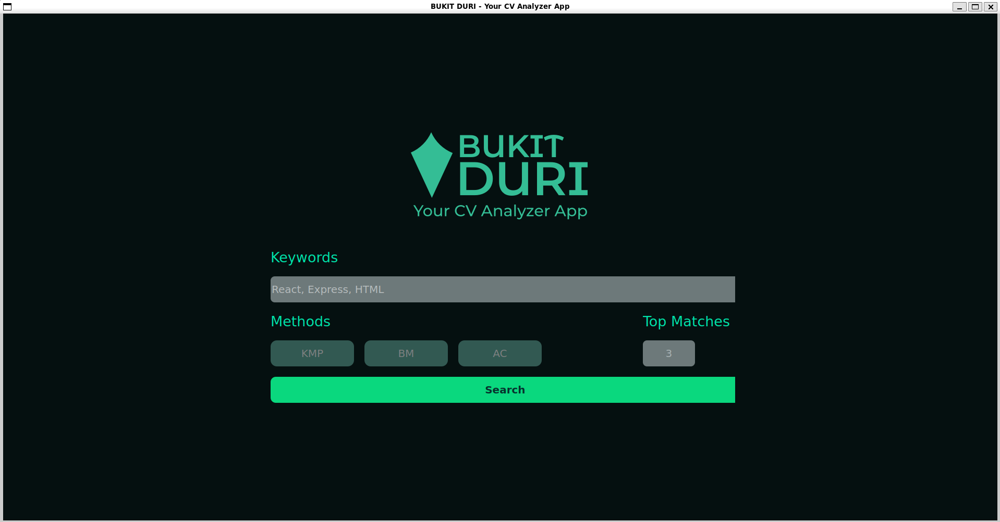

# BukitDuri -  Sistem ATS (Applicant Tracking System) Berbasis CV Digital

BukitDuri adalah aplikasi pencarian CV (Curriculum Vitae) yang menggunakan algoritma string matching untuk menemukan CV yang paling relevan berdasarkan kata kunci yang dimasukkan pengguna. Aplikasi ini dibangun menggunakan Python dengan GUI PyQt5 dan database MySQL.

## Daftar Isi
- [Fitur Utama](#-fitur-utama)
- [Algoritma yang Diimplementasikan](#-algoritma-yang-diimplementasikan)
- [Tim Bukit Duri](#-tim-bukit-duri)
- [Requirements](#-requirements)
- [Instalasi](#-instalasi)
- [Cara Menjalankan](#-cara-menjalankan)
- [Cara Penggunaan](#-cara-penggunaan)
- [Struktur Project](#-struktur-project)
- [Enkripsi Data](#-enkripsi-data)

## Fitur Utama

- **Pencarian CV dengan Multiple Algoritma**: KMP, Boyer-Moore, dan Fuzzy Search
- **GUI yang User-friendly**: Interface modern menggunakan PyQt5
- **Database Integration**: Penyimpanan data CV dalam MySQL
- **PDF Processing**: Ekstraksi teks dari file PDF CV
- **Data Encryption**: Enkripsi data sensitif untuk keamanan
- **Summary Generation**: Tampilan ringkasan profil dari CV
- **Search Result Ranking**: Ranking hasil pencarian berdasarkan relevansi

## Algoritma yang Diimplementasikan

### 1. Knuth-Morris-Pratt (KMP)
Algoritma KMP adalah algoritma pencarian string yang efisien dengan kompleksitas waktu O(n+m). Algoritma ini menggunakan tabel LPS (Longest Prefix Suffix) untuk menghindari pengecekan karakter yang tidak perlu saat terjadi mismatch.

**Keunggulan:**
- Kompleksitas waktu linear O(n+m)
- Tidak pernah mundur pada teks input
- Efisien untuk pattern yang memiliki prefix dan suffix yang sama

### 2. Boyer-Moore (BM)
Algoritma Boyer-Moore adalah algoritma pencarian string yang menggunakan dua heuristik: Bad Character Rule dan Good Suffix Rule. Algoritma ini memulai pencocokan dari kanan ke kiri dan dapat melompati beberapa karakter sekaligus.

**Keunggulan:**
- Rata-rata lebih cepat dari algoritma naive
- Sangat efisien untuk text yang besar
- Kompleksitas terbaik O(n/m) untuk text yang besar

### 3. Fuzzy Search
Algoritma pencarian yang toleran terhadap kesalahan ejaan dan variasi penulisan menggunakan Levenshtein Distance dan similarity scoring.

**Keunggulan:**
- Toleran terhadap typo dan variasi ejaan
- Dapat menemukan hasil yang mirip meskipun tidak exact match
- Menggunakan threshold similarity untuk akurasi

## Tim Bukit Duri

| Nama | NIM | 
|------|-----|
| Raka Daffa Iftikhaar | 13523018 |
| Muhammad Fithra Rizki | 13523049 |
| Bevinda Vivian | 13523120 |

## Requirements

### System Requirements
- **Operating System**: Windows 10/11, macOS, atau Linux
- **Python**: Version 3.8 atau lebih baru
- **MySQL**: Version 8.0 atau lebih baru
- **Memory**: Minimal 4GB RAM
- **Storage**: Minimal 2GB free space

### System Dependencies

#### Windows
```powershell
Install Visual C++ Redistributable (untuk PyQt5)
# Download dari: https://aka.ms/vs/17/release/vc_redist.x64.exe

PDF Viewer (salah satu dari):
# - Adobe Acrobat Reader (Recommended)
# - Microsoft Edge (Built-in)
# - Chromium pada wsl
# sudo apt update, lalu sudo apt install -y chromium-browser, export BROWSER=chromium-browser

```

#### macOS
```bash
# Install Xcode Command Line Tools (untuk build dependencies)
xcode-select --install

# PDF Viewer (Built-in Preview app sudah cukup)
```

#### Linux (Ubuntu/Debian)
```bash
# Install system dependencies untuk PyQt5
sudo apt-get update
sudo apt-get install python3-pyqt5 python3-pyqt5.qtwidgets python3-pyqt5.qtgui python3-pyqt5.qtcore

# Install build dependencies
sudo apt-get install build-essential python3-dev

# PDF Viewer (pilih salah satu):
sudo apt-get install evince          # GNOME Document Viewer
sudo apt-get install okular          # KDE Document Viewer  
sudo apt-get install xpdf            # Lightweight PDF viewer
```

#### Linux (CentOS/RHEL/Fedora)
```bash
# Install system dependencies untuk PyQt5
sudo dnf install python3-qt5 python3-qt5-devel

# Install build dependencies
sudo dnf install gcc python3-devel

# PDF Viewer
sudo dnf install evince              # GNOME Document Viewer
```

### Python Dependencies
```
PyQt5==5.15.10
mysql-connector-python==8.2.0
python-Levenshtein==0.21.1
PyMuPDF==1.23.14
fuzzywuzzy==0.18.0
PyPDF2
pandas>=1.5.0
numpy>=1.21.0
tkinter 
Pillow>=9.0.0
pytest>=7.0.0
pytest-cov>=4.0.0
```

### Optional Dependencies untuk Development
```bash
# Untuk testing dan code coverage
pytest-qt>=4.0.0           # GUI testing
pytest-mock>=3.0.0         # Mocking utilities

# Untuk code quality
black>=22.0.0               # Code formatter
flake8>=4.0.0              # Linting
mypy>=0.950                # Type checking
```

## Instalasi

### 1. Clone Repository
```bash
git clone https://github.com/rakdaf08/Tubes3_BukitDuri
cd Tubes3_BukitDuri
```

### 2. Install Python Dependencies
```bash
pip install -r requirement.txt
```

### 3. Setup MySQL Database
1. Install MySQL Server jika belum ada
2. Buat user MySQL atau gunakan user root
3. Pastikan MySQL service berjalan

### 4. Konfigurasi Database
Edit file `config.py` untuk mengatur koneksi database:
```python
DATABASE_CONFIG = {
    'host': 'localhost',
    'user': 'root',
    'password': 'password_mysql_anda',  # Ganti dengan password MySQL Anda
    'database': 'Tubes3Stima'
}
```

## Cara Menjalankan

### 1. Setup Database (Pertama Kali)
```bash
python setup_database.py
```
Langkah ini opsional karena saat menjalankan GUI akan diload lagi setiap kali program dijalankan. Script ini akan:
- Membuat database dan tabel yang diperlukan
- Mengimpor data seeding dari `tubes3_seeding.sql`
- Memproses file PDF CV dan menyimpan ke database

### 2. Jalankan Aplikasi GUI
```bash
python src/main_gui.py
```

### 3. Jalankan Aplikasi Console (Opsional)
```bash
python src/main.py
```

### 4. Setup Enkripsi (Opsional)
Jika ingin mengaktifkan enkripsi data:
```bash
python src/encryption/fix_database_schema.py
python src/encryption/encrypt_existing_data.py
```
Cek status enkripsi:
```bash
python src/encryption/check_encryption_status.py
```

## Cara Penggunaan

### 1. Akses Aplikasi
- Jalankan aplikasi menggunakan command di atas
- Aplikasi akan membuka GUI BukitDuri

### 2. Melakukan Pencarian
1. **Masukkan Kata Kunci**: Input kata kunci pencarian pada search box
2. **Pilih Algoritma**: Pilih algoritma pencarian (KMP atau Boyer-Moore)
3. **Tentukan Jumlah Hasil**: Set jumlah hasil yang ingin ditampilkan
4. **Klik Search**: Tekan tombol search untuk memulai pencarian

### 3. Melihat Hasil
- Sistem akan menampilkan daftar CV yang paling relevan
- Setiap CV dilengkapi dengan:
  - **View More*: Untuk melihat ringkasan profil
  - **View CV Button**: Untuk melihat CV asli dalam format PDF

### 4. Detail Hasil Pencarian
- Results ditampilkan berdasarkan ranking relevansi
- Informasi timing pencarian ditampilkan
- Keyword yang ditemukan di-highlight

## Struktur Project

```
Tubes3_BukitDuri/
├── src/
│   ├── main.py                 
│   ├── main_gui.py            
│   ├── core/
│   │   ├── extractor.py       
│   │   └── matcher.py         
│   ├── db/
│   │   ├── __init__.py
│   │   └── db_connector.py    
│   ├── gui/
│   │   ├── landing_gui.py     
│   │   ├── home_gui.py        
│   │   ├── summary_gui.py     
│   │   └── database_setup_gui.py 
│   └── encryption/
│       ├── encryption_engine.py    
│       ├── encrypt_existing_data.py
│       ├── fix_database_schema.py  
│       └── check_encryption_status.py 
├── data/
│   ├── pdf/        
│   ├── string/     
│   └── regex/      
├── doc/            
├── config.py       
├── setup_database.py 
├── tubes3_seeding.sql 
├── requirement.txt    
└── README.md          
```

## Enkripsi Data

Aplikasi mendukung enkripsi untuk data sensitif seperti:
- Nama depan dan belakang
- Alamat
- Nomor telepon

### Mengaktifkan Enkripsi
1. Set `ENCRYPTION_SETTINGS['enabled'] = True` di `config.py`
2. Jalankan migration script untuk schema
3. Jalankan encryption script untuk data existing

```
python3 src/encryption/fix_database_schema.py
python3 src/encryption/encrypt_existing_data.py
python3 src/encryption/check_encryption_status.py
```

### Konfigurasi Enkripsi
```python
ENCRYPTION_SETTINGS = {
    'enabled': True,  # Set to False untuk disable encryption
    'encrypt_fields': [
        'first_name', 
        'last_name', 
        'address', 
        'phone_number'
    ],
    'master_key': 'BukitDuri_SecureKey_CV_Analyzer'
}
```

## Troubleshooting

### Database Connection Error
- Pastikan MySQL service berjalan
- Cek username dan password di `config.py`
- Pastikan database `Tubes3Stima` sudah dibuat

### Missing Dependencies
```bash
pip install --upgrade pip
pip install -r requirement.txt
```

### PDF Processing Error
- Pastikan file PDF tidak corrupt
- Check permission untuk membaca file PDF
- Pastikan PyMuPDF dan PyPDF2 terinstall dengan benar